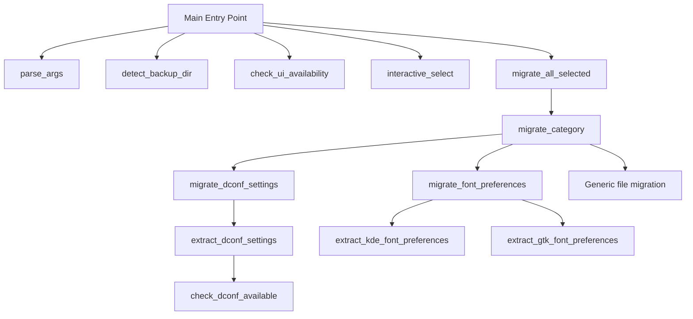
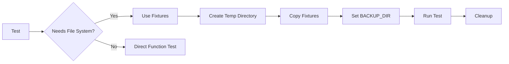

# Testing Strategy for migrate-settings.sh

## Overview

This document outlines a comprehensive testing strategy for `migrate-settings.sh`, which handles migration of 8 categories: keychain, dconf, fonts, wallpaper, color-schemes, cursor-themes, icon-themes, and gtk-themes.

## Current State Analysis

### Script Structure

The script contains the following testable components:



### Key Functions to Test

| Function | Type | Dependencies | Test Priority |
|----------|------|--------------|---------------|
| `extract_kde_font_preferences()` | Pure extraction | File path | High |
| `extract_gtk_font_preferences()` | Pure extraction | File path | High |
| `extract_dconf_settings()` | Extraction | dconf binary, backup dir | High |
| `migrate_font_preferences()` | Migration | File system, DRY_RUN | Medium |
| `migrate_dconf_settings()` | Migration | dconf binary, DRY_RUN | Medium |
| `migrate_category()` | Orchestration | All above | Medium |
| `detect_backup_dir()` | Detection | File system | Low |
| `get_available_settings()` | Query | File system | Low |
| `get_category_item_count()` | Query | File system | Low |

### Existing Test Infrastructure

1. **BATS Framework** (`tests/migration.bats`)
   - Already tests flatpak functions, image detection, config paths
   - Uses `MOCK_BOOTC` environment variable for mocking
   - Provides `setup()` function for test initialization

2. **Custom Bash Framework** (`tests/run_tests.sh`)
   - Provides assertion helpers: `assert_equals`, `assert_contains`, `assert_not_empty`, `assert_file_exists`
   - Has pass/fail tracking
   - Good for simple tests without BATS dependency

## Testing Architecture

### Test File Organization

```
tests/
├── migration.bats           # Existing BATS tests
├── run_tests.sh             # Existing custom tests
├── settings-migration.bats  # NEW: BATS tests for migrate-settings.sh
├── fixtures/                # NEW: Test fixtures
│   ├── kdeglobals           # Sample KDE config
│   ├── gtk-settings.ini     # Sample GTK config
│   ├── dconf-user           # Sample dconf database
│   └── backup-structure/    # Sample backup directory layout
│       └── configs/
│           ├── .config/
│           │   ├── dconf/
│           │   │   └── user
│           │   ├── gtk-3.0/
│           │   │   └── settings.ini
│           │   ├── gtk-4.0/
│           │   │   └── settings.ini
│           │   └── kdeglobals
│           └── .local/
│               └── share/
│                   ├── backgrounds/
│                   ├── color-schemes/
│                   └── icons/
└── lib/
    └── test-helpers.bash    # NEW: Shared test utilities
```

### Mock Strategy



## Test Cases

### 1. Unit Tests: Extraction Functions

#### `extract_kde_font_preferences()`

| Test Case | Input | Expected Output |
|-----------|-------|-----------------|
| Valid kdeglobals with fonts | kdeglobals fixture | Font settings extracted |
| kdeglobals without font keys | Minimal kdeglobals | Return code 1 |
| Non-existent file | Invalid path | Return code 1 |
| Empty file | Empty kdeglobals | Return code 1 |

```bash
# Example BATS test
@test "extract_kde_font_preferences extracts font settings" {
    source "$ROOT_DIR/migrate-settings.sh"
    
    # Create test file
    cat > "$BATS_TEST_TMPDIR/kdeglobals" << EOF
[General]
font=Noto Sans,10,-1,5,50,0,0,0,0,0
menuFont=Noto Sans,10,-1,5,50,0,0,0,0,0
EOF
    
    run extract_kde_font_preferences "$BATS_TEST_TMPDIR/kdeglobals"
    [ "$status" -eq 0 ]
    [[ "$output" == *"font="* ]]
    [[ "$output" == *"menuFont="* ]]
}
```

#### `extract_gtk_font_preferences()`

| Test Case | Input | Expected Output |
|-----------|-------|-----------------|
| Valid settings.ini with font | GTK fixture | font-name extracted |
| settings.ini without font | Minimal GTK config | Return code 1 |
| Non-existent file | Invalid path | Return code 1 |

#### `extract_dconf_settings()`

| Test Case | Input | Expected Output |
|-----------|-------|-----------------|
| Valid dconf backup | dconf fixture | Settings extracted |
| No dconf backup | Empty backup dir | Return code 1 |
| dconf not available | Mock unavailable dconf | Uses strings fallback |

### 2. Unit Tests: Migration Functions

#### `migrate_font_preferences()` - Dry Run Mode

| Test Case | Setup | Expected Behavior |
|-----------|-------|-------------------|
| KDE fonts dry-run | BACKUP_DIR with kdeglobals | Shows what would be done |
| GTK fonts dry-run | BACKUP_DIR with settings.ini | Shows what would be done |
| No source files | Empty BACKUP_DIR | Skips with debug message |

```bash
@test "migrate_font_preferences dry-run shows preview" {
    source "$ROOT_DIR/lib/common.sh"
    source "$ROOT_DIR/migrate-settings.sh"
    
    DRY_RUN=true
    BACKUP_DIR="$BATS_TEST_TMPDIR/backup"
    mkdir -p "$BACKUP_DIR/configs/.config"
    
    cat > "$BACKUP_DIR/configs/.config/kdeglobals" << EOF
[General]
font=Noto Sans,10
EOF
    
    run migrate_font_preferences "fonts"
    [ "$status" -eq 0 ]
    [[ "$output" == *"[DRY-RUN]"* ]]
    [[ "$output" == *"font="* ]]
}
```

#### `migrate_dconf_settings()` - Dry Run Mode

| Test Case | Setup | Expected Behavior |
|-----------|-------|-------------------|
| dconf available, dry-run | Mock dconf, BACKUP_DIR | Shows settings preview |
| dconf unavailable | Mock no dconf | Warning message |
| No dconf backup | Empty BACKUP_DIR | Skips |

### 3. Integration Tests: Category Migration

#### `migrate_category()` - All Categories

| Category | Test Focus |
|----------|------------|
| keychain | Warning displayed, files copied |
| dconf | Delegates to migrate_dconf_settings |
| fonts | Delegates to migrate_font_preferences |
| wallpaper | Files copied to correct locations |
| color-schemes | Files copied, directory created |
| cursor-themes | Default themes filtered out |
| icon-themes | Default themes filtered out |
| gtk-themes | GTK config files migrated |

```bash
@test "migrate_category handles wallpaper migration" {
    source "$ROOT_DIR/lib/common.sh"
    source "$ROOT_DIR/migrate-settings.sh"
    
    BACKUP_DIR="$BATS_TEST_TMPDIR/backup"
    mkdir -p "$BACKUP_DIR/configs/.local/share/backgrounds"
    echo "wallpaper-data" > "$BACKUP_DIR/configs/.local/share/backgrounds/wallpaper.png"
    
    # Mock HOME to temp directory
    HOME="$BATS_TEST_TMPDIR/home"
    
    run migrate_category "wallpaper"
    [ "$status" -eq 0 ]
    [ -f "$HOME/.local/share/backgrounds/wallpaper.png" ]
}
```

### 4. Error Path Tests

| Test Case | Scenario | Expected Behavior |
|-----------|----------|-------------------|
| Permission denied | Read-only destination | Error message, continues |
| Disk full | No space | Error message, graceful exit |
| Invalid backup dir | Non-existent directory | Error and exit |
| Corrupted dconf | Invalid binary data | Graceful handling |
| Missing dependencies | No dconf installed | Warning, skip dconf |

```bash
@test "migrate_category handles permission errors gracefully" {
    source "$ROOT_DIR/lib/common.sh"
    source "$ROOT_DIR/migrate-settings.sh"
    
    BACKUP_DIR="$BATS_TEST_TMPDIR/backup"
    mkdir -p "$BACKUP_DIR/configs/.local/share/backgrounds"
    
    # Create read-only destination
    HOME="$BATS_TEST_TMPDIR/readonly_home"
    mkdir -p "$HOME/.local/share"
    chmod -w "$HOME/.local/share"
    
    run migrate_category "wallpaper"
    # Should handle error gracefully
    [ "$status" -eq 0 ]  # Returns 0 but with error count
}
```

### 5. Dry-Run Mode Tests

| Test Case | Command | Expected Behavior |
|-----------|---------|-------------------|
| Full dry-run | `--dry-run` | Shows preview, no changes |
| Dry-run with backup dir | `--dry-run --backup-dir /path` | Uses specified dir |
| Dry-run --all | `--dry-run --all` | Shows all categories |

```bash
@test "--dry-run shows preview without making changes" {
    # Setup mock backup
    export BACKUP_DIR="$BATS_TEST_TMPDIR/backup"
    mkdir -p "$BACKUP_DIR/configs/.config/dconf"
    
    # Run with dry-run
    run "$ROOT_DIR/migrate-settings.sh" --dry-run --backup-dir "$BACKUP_DIR"
    [ "$status" -eq 0 ]
    [[ "$output" == *"SETTINGS PREVIEW"* ]]
    
    # Verify no changes made
    [ ! -d "$HOME/.config/dconf" ] || fail "Dry-run made changes"
}
```

### 6. Argument Parsing Tests

| Test Case | Arguments | Expected State |
|-----------|-----------|----------------|
| Help flag | `--help` | Shows help, exits 0 |
| Verbose flag | `--verbose` | VERBOSE=true |
| Yes mode | `--yes` | YES_MODE=true |
| Dry-run | `--dry-run` | DRY_RUN=true |
| All mode | `--all` | MIGRATE_ALL=true |
| Custom backup dir | `--backup-dir /path` | BACKUP_DIR set |
| Invalid backup dir | `--backup-dir /nonexistent` | Error, exit 1 |
| Unknown option | `--invalid` | Warning, continues |

## Test Fixtures

### kdeglobals Fixture

```ini
[General]
font=Noto Sans,10,-1,5,50,0,0,0,0,0
menuFont=Noto Sans,10,-1,5,50,0,0,0,0,0
toolBarFont=Noto Sans,10,-1,5,50,0,0,0,0,0
desktopFont=Noto Sans,10,-1,5,50,0,0,0,0,0
fixed=Noto Mono,10,-1,5,50,0,0,0,0,0

[KDE]
LookAndFeelPackage=org.kde.breeze.desktop

[Icons]
Theme=breeze
```

### GTK settings.ini Fixture

```ini
[Settings]
font-name=Noto Sans 10
gtk-theme-name=Adwaita
icon-theme-name=Adwaita
cursor-theme-name=Adwaita
```

### dconf User Database Fixture

Create a minimal binary dconf database or use `strings` output:

```
/org/gnome/desktop/interface/font-name:'Noto Sans 10'
/org/gnome/desktop/interface/monospace-font-name:'Noto Mono 10'
/org/gnome/desktop/interface/gtk-theme:'Adwaita'
/org/gnome/desktop/interface/icon-theme:'Adwaita'
/org/gnome/desktop/interface/cursor-theme:'Adwaita'
/org/gnome/desktop/background/picture-uri:'file:///home/user/background.jpg'
```

## Implementation Approach

### Phase 1: Test Infrastructure Setup

1. Create `tests/fixtures/` directory structure
2. Create `tests/lib/test-helpers.bash` with shared utilities
3. Add fixture files for kdeglobals, GTK settings, dconf

### Phase 2: Unit Tests for Extraction Functions

1. Test `extract_kde_font_preferences()` with various inputs
2. Test `extract_gtk_font_preferences()` with various inputs
3. Test `extract_dconf_settings()` with mock data

### Phase 3: Unit Tests for Migration Functions

1. Test `migrate_font_preferences()` in dry-run mode
2. Test `migrate_dconf_settings()` in dry-run mode
3. Test `migrate_category()` for each category type

### Phase 4: Integration Tests

1. Test full migration flow with mock backup
2. Test `--all` mode
3. Test interactive selection (mocked)

### Phase 5: Error Path Tests

1. Test permission errors
2. Test missing dependencies
3. Test corrupted input data

### Phase 6: Documentation

1. Update README with testing instructions
2. Document test fixtures and their purpose
3. Add CI integration notes

## Test Helpers Module

Create `tests/lib/test-helpers.bash`:

```bash
#!/bin/bash

# Create a mock backup directory structure
create_mock_backup() {
    local base_dir="$1"
    mkdir -p "$base_dir/configs/.config/dconf"
    mkdir -p "$base_dir/configs/.config/gtk-3.0"
    mkdir -p "$base_dir/configs/.config/gtk-4.0"
    mkdir -p "$base_dir/configs/.local/share/backgrounds"
    mkdir -p "$base_dir/configs/.local/share/icons"
    mkdir -p "$base_dir/configs/.local/share/color-schemes"
}

# Create mock kdeglobals
create_mock_kdeglobals() {
    local file="$1"
    cat > "$file" << 'EOF'
[General]
font=Noto Sans,10,-1,5,50,0,0,0,0,0
menuFont=Noto Sans,10,-1,5,50,0,0,0,0,0
toolBarFont=Noto Sans,10,-1,5,50,0,0,0,0,0
EOF
}

# Create mock GTK settings.ini
create_mock_gtk_settings() {
    local file="$1"
    cat > "$file" << 'EOF'
[Settings]
font-name=Noto Sans 10
gtk-theme-name=Adwaita
EOF
}

# Mock dconf command
mock_dconf() {
    # Create a script that mimics dconf behavior
    local mock_dir="$BATS_TEST_TMPDIR/bin"
    mkdir -p "$mock_dir"
    cat > "$mock_dir/dconf" << 'EOF'
#!/bin/bash
case "$1" in
    write) echo "Mock dconf write: $2 = $3" ;;
    read) echo "mock-value" ;;
    dump) echo "[mock/path]\nkey=value" ;;
    *) echo "Unknown dconf command" ;;
esac
EOF
    chmod +x "$mock_dir/dconf"
    export PATH="$mock_dir:$PATH"
}

# Skip test if running as root
skip_if_root() {
    if [[ $EUID -eq 0 ]]; then
        skip "Test cannot run as root"
    fi
}
```

## Running Tests

### BATS Tests

```bash
# Run all BATS tests
bats tests/

# Run specific test file
bats tests/settings-migration.bats

# Run with verbose output
bats --tap tests/settings-migration.bats
```

### Custom Tests

```bash
# Run all custom tests
./tests/run_tests.sh

# Run with verbose output
VERBOSE=true ./tests/run_tests.sh
```

### CI Integration

```yaml
# Example GitHub Actions workflow
name: Tests
on: [push, pull_request]
jobs:
  test:
    runs-on: ubuntu-latest
    steps:
      - uses: actions/checkout@v4
      - name: Install dependencies
        run: |
          sudo apt-get install -y bats whiptail
      - name: Run BATS tests
        run: bats tests/
      - name: Run custom tests
        run: ./tests/run_tests.sh
```

## Summary

This testing strategy provides:

1. **Isolation**: Functions can be tested without real desktop environment
2. **Fixtures**: Sample config files for consistent testing
3. **Mocking**: Ability to mock dconf, file system, and user input
4. **Coverage**: Tests for success paths, error paths, and dry-run mode
5. **Integration**: Works with existing BATS and custom test frameworks

The implementation should proceed in phases, starting with test infrastructure and extraction function tests, then moving to migration functions and integration tests.
