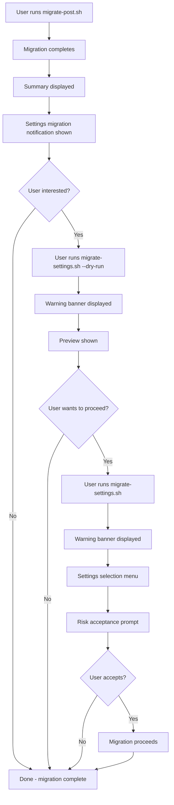

# Design: Optional Settings Migration with Clear Warnings

## Overview

This document specifies the implementation approach for making settings migration strictly optional with clear warnings about its fragile nature. The goal is to ensure users understand that `migrate-settings.sh` is experimental, requires explicit opt-in, and may not work perfectly in all cases.

## Current State Analysis

| Component | Current Behavior | Issue |
|-----------|------------------|-------|
| [`migrate-settings.sh`](../migrate-settings.sh) | Standalone script with help text | No warnings about experimental/fragile nature |
| [`migrate-post.sh`](../migrate-post.sh) | Prints summary after migration | No notification about settings migration availability |
| [`README.md`](../README.md) | Documents main migration flow | No mention of settings migration at all |

## Design Recommendations

### 1. User Notification in migrate-post.sh

#### Location
Add notification in the [`print_summary()`](../migrate-post.sh:171) function, after the "Tip" section and before the final output.

#### Message Design

```
┌─────────────────────────────────────────────────────────────────┐
│ ⚠️  OPTIONAL: Settings Migration                                │
│                                                                 │
│ An experimental settings migration script is available:         │
│   ~/config-migration-backup-XXXXXX/migrate-settings.sh          │
│                                                                 │
│ This can migrate: fonts, wallpaper, themes, icons, and more.   │
│                                                                 │
│ ⚠️  WARNING: This feature is EXPERIMENTAL and may not work     │
│     correctly in all cases. Some settings may not transfer      │
│     properly between GNOME and KDE.                             │
│                                                                 │
│ Recommended: Run with --dry-run first to preview changes.       │
└─────────────────────────────────────────────────────────────────┘
```

#### Implementation Location

Insert after line 205 in [`migrate-post.sh`](../migrate-post.sh:205):

```bash
# After the "Tip:" section, add:
echo ""
echo -e "${YELLOW}┌─────────────────────────────────────────────────────────────────┐${RESET}"
echo -e "${YELLOW}│${RESET} ${BOLD}⚠️  OPTIONAL: Settings Migration${RESET}                                "
echo -e "${YELLOW}│${RESET}                                                                 "
echo -e "${YELLOW}│${RESET} An experimental settings migration script is available:         "
echo -e "${YELLOW}│${RESET}   $(basename "$BACKUP_DIR")/migrate-settings.sh          "
echo -e "${YELLOW}│${RESET}                                                                 "
echo -e "${YELLOW}│${RESET} This can migrate: fonts, wallpaper, themes, icons, and more.   "
echo -e "${YELLOW}│${RESET}                                                                 "
echo -e "${YELLOW}│${RESET} ${RED}⚠️  WARNING:${RESET} This feature is ${BOLD}EXPERIMENTAL${RESET} and may not work     "
echo -e "${YELLOW}│${RESET}     correctly in all cases. Some settings may not transfer      "
echo -e "${YELLOW}│${RESET}     properly between GNOME and KDE.                             "
echo -e "${YELLOW}│${RESET}                                                                 "
echo -e "${YELLOW}│${RESET} Recommended: Run with ${BOLD}--dry-run${RESET} first to preview changes.       "
echo -e "${YELLOW}└─────────────────────────────────────────────────────────────────┘${RESET}"
```

### 2. Warning Banners in migrate-settings.sh

#### Startup Banner

Add a prominent warning banner at script start (after line 1043 in [`main()`](../migrate-settings.sh:1040)):

```
╔═════════════════════════════════════════════════════════════════════╗
║                                                                     ║
║  ⚠️  EXPERIMENTAL FEATURE - USE AT YOUR OWN RISK                   ║
║                                                                     ║
║  Settings migration between desktop environments is fragile and     ║
║  may not work correctly in all cases.                              ║
║                                                                     ║
║  • Some settings may not transfer properly                         ║
║  • Desktop-specific configurations may cause issues                ║
║  • Always test with --dry-run first                                ║
║  • Ensure you have backups of important data                       ║
║                                                                     ║
║  This script is provided as-is with no guarantees.                 ║
║                                                                     ║
╚═════════════════════════════════════════════════════════════════════╝
```

#### Help Output Enhancement

Update [`show_settings_help()`](../migrate-settings.sh:14) to include a warning section:

```bash
${BOLD}${RED}⚠️  EXPERIMENTAL FEATURE${RESET}

    This script is ${BOLD}experimental${RESET} and settings migration between
    desktop environments is inherently fragile. Some settings may not
    transfer correctly or may cause unexpected behavior.

    ${BOLD}Recommendations:${RESET}
    • Always run with ${BOLD}--dry-run${RESET} first to preview changes
    • Back up important data before proceeding
    • Test migrated settings thoroughly after running
    • Be prepared to manually adjust some settings

${BOLD}SETTINGS THAT CAN BE MIGRATED${RESET}
    ...
```

#### Confirmation Prompt Enhancement

When the user selects settings to migrate, add an explicit consent prompt:

```
You have selected the following settings to migrate:
  - Font preferences
  - Wallpaper
  - Color schemes

⚠️  WARNING: This is an experimental feature. Some settings may not
   transfer correctly between GNOME and KDE desktop environments.

   Do you understand and accept these risks? [y/N]
```

### 3. Documentation Updates

#### README.md Updates

Add a new section after "Phase 3: Post-Rebase":

```markdown
### Phase 4: Optional Settings Migration (Experimental)

After completing the main migration, you may optionally attempt to migrate
desktop settings between environments using the settings migration script:

```bash
~/config-migration-backup-YYYYMMDD-HHMMSS/migrate-settings.sh --dry-run
```

#### What Settings Migration Can Transfer

| Setting | Description | Notes |
|---------|-------------|-------|
| Font preferences | Default font selections | May need manual adjustment |
| Wallpaper | Desktop background images | Path references may break |
| Color schemes | Desktop color schemes | Format conversion may be imperfect |
| Cursor themes | Mouse cursor themes | Usually works well |
| Icon themes | User-custom icon themes | Default DE themes excluded |
| GTK themes | GTK theme settings | May need adjustment |
| Keychain/Wallet | Credentials | Often has compatibility issues |

#### ⚠️ Important Warnings

**This feature is experimental and may not work correctly in all cases.**

- Settings migration between GNOME and KDE is inherently fragile
- Some settings may not transfer properly or at all
- Desktop-specific configurations may cause issues
- **Always run with `--dry-run` first** to preview changes
- Keep backups of important configurations

#### Settings Migration Options

| Option | Description |
|--------|-------------|
| `-h, --help` | Show help message |
| `-v, --verbose` | Enable verbose output |
| `-y, --yes` | Skip all confirmations |
| `--dry-run` | Preview without making changes |
| `--all` | Migrate all compatible settings |
| `--backup-dir <dir>` | Specify backup directory |

#### Example Usage

```bash
# Preview what would be migrated
~/config-migration-backup-*/migrate-settings.sh --dry-run

# Interactively select settings to migrate
~/config-migration-backup-*/migrate-settings.sh

# Migrate all compatible settings
~/config-migration-backup-*/migrate-settings.sh --all
```
```

### 4. Implementation Checklist

#### migrate-post.sh Changes

- [ ] Add settings migration notification box in `print_summary()` function
- [ ] Include path to migrate-settings.sh in the notification
- [ ] Display warning about experimental nature
- [ ] Recommend `--dry-run` usage

#### migrate-settings.sh Changes

- [ ] Add experimental warning banner at script startup
- [ ] Update `show_settings_help()` with warning section
- [ ] Add explicit risk acceptance confirmation prompt
- [ ] Ensure warning appears before any migration actions

#### README.md Changes

- [ ] Add "Phase 4: Optional Settings Migration" section
- [ ] Document what settings can be migrated
- [ ] Include warnings about experimental nature
- [ ] Add options table for migrate-settings.sh
- [ ] Provide example usage commands

## User Experience Flow



## Message Templates

### Box Drawing Characters Reference

| Character | Usage |
|-----------|-------|
| `╔` `╗` `╚` `╝` | Double-line box corners |
| `║` | Double-line vertical |
| `═` | Double-line horizontal |
| `┌` `┐` `└` `┘` | Single-line box corners |
| `│` | Single-line vertical |
| `─` | Single-line horizontal |

### Color Codes

| Variable | Color | Usage |
|----------|-------|-------|
| `${RED}` | Red | Warnings, errors |
| `${YELLOW}` | Yellow | Caution, experimental |
| `${GREEN}` | Green | Success |
| `${BOLD}` | Bold | Emphasis |
| `${RESET}` | Reset | End formatting |

## Summary

This design ensures that:

1. **Users are informed** - The post-migration summary clearly indicates the availability of settings migration
2. **Risks are visible** - Multiple warning points ensure users understand the experimental nature
3. **Consent is explicit** - Users must actively acknowledge risks before migration proceeds
4. **Documentation is complete** - README provides full context for the feature

The implementation maintains the strictly optional nature of settings migration while ensuring users can make informed decisions about whether to use it.
